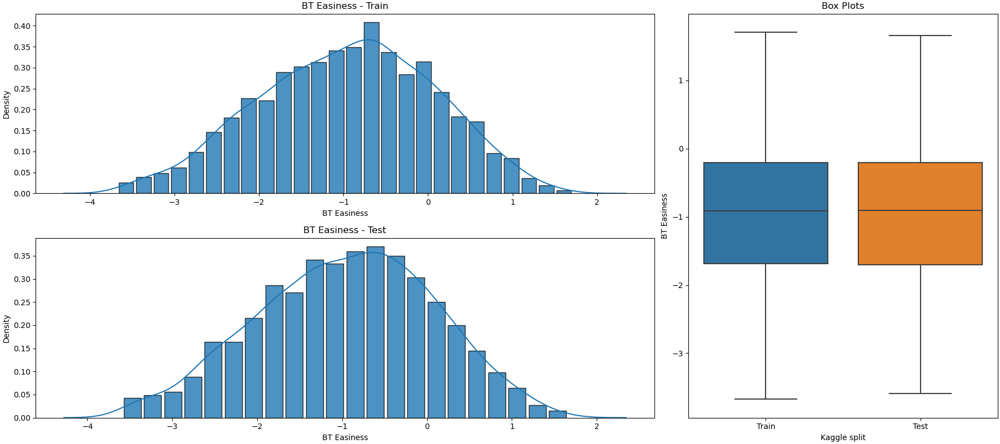

# CommonLit Readability Prize

***This project is being actively developed. Stay tuned!***

## Table of Contents
* [Introduction](#introduction)
* [Algorithms](#algorithms)
* [References](#references)

## Introduction
This repository hosts a study over a past Kaggle competition named [CommonLit Readability Prize](https://www.kaggle.com/competitions/commonlitreadabilityprize/). The English excerpts are given readability scores by English teaching experts, and the aim of the competition is to predict the readability score of each excerpt, in its simplest form a regression problem. The dataset used in this competition (including the test data) is published as CommonLit Ease of Readability Corpus (CLEAR) and can be accessed [here](https://www.commonlit.org/blog/introducing-the-clear-corpus-an-open-dataset-to-advance-research-28ff8cfea84a/)

For determining the readability scores of the excerpts, pairs of excerpts are presented to expert judges, and they are asked to choose the excerpt which is easier to read from each pair. After some post-processing steps are applied to the pairwise comparisons, Bradley-Terry modeling ([Wikipedia](#bradley-terry-wiki)) is applied in order to compute the readability scores of each excerpt. The details of the data collection procedure are explained in ([Crossley, 2021](#crossley-2021)) and ([Crossley, 2022](#crossley-2022)).

The following figure presents the readability score distributions for test and train splits of the dataset. 

As can be seen in the figure, the readability score distributions are similar for the test and train splits, resembling Gaussian distributions.

## Algorithms

TODO TODO TODO

## References

Bradley-Terry Model Wikipedia Page
https://en.wikipedia.org/wiki/Bradley-Terry_model

Crossley, S. A., Heintz, A., Choi, J., Batchelor, J., & Karimi, M. (2021),
_The CommonLit Ease of Readability (CLEAR) Corpus,_
Proceedings of the 14th International Conference on Educational Data Mining (EDM),
https://educationaldatamining.org/EDM2021/virtual/static/pdf/EDM21_paper_35.pdf

Crossley, S. A., Heintz, A., Choi, J., Batchelor, J., Karimi, M., & Malatinszky, A. (2022),
_A large-scaled corpus for assessing text readability,_
Behavior Research Methods,
https://link.springer.com/article/10.3758/s13428-022-01802-x

